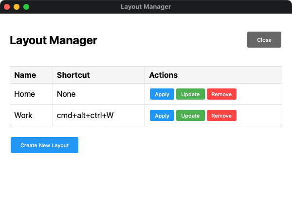

# LayoutManager.spoon

A comprehensive window layout manager for Hammerspoon with GUI interface and menubar quick access.



## Features

- 🖥️ **GUI Interface**: Clean, table-based interface for layout management
- 📐 **Menubar Integration**: Quick access to apply layouts without opening GUI
- ⌨️ **Keyboard Shortcuts**: Assign custom shortcuts to layouts
- 📸 **Window Snapshotting**: Capture current window positions and sizes
- 🖥️ **Multi-screen Support**: Works seamlessly with multiple monitors
- 💾 **Persistent Storage**: Layouts automatically saved and restored
- 🌐 **Dual Storage Modes**: Choose between screen-relative and global coordinates
- 🔄 **Location Independence**: Global coordinates mode works across different monitor setups

## Installation

### Method 1: Manual Installation
1. Download `LayoutManager.spoon.zip` from the releases page
2. Unzip the file
3. Double-click `LayoutManager.spoon` to install it to Hammerspoon

### Method 2: Git Clone
```bash
cd ~/.hammerspoon/Spoons/
git clone https://github.com/christophe-calmejane/LayoutManager.spoon.git
```

### Configuration
Add to your `~/.hammerspoon/init.lua`:
```lua
local layoutManager = hs.loadSpoon("LayoutManager")
layoutManager:init()
```

Then reload your Hammerspoon configuration.

## Usage

### Opening the Interface
- **Menubar**: Click the 📐 icon in your menubar

### Creating Layouts
1. Arrange your windows as desired
2. Open Layout Manager
3. Click "Create New Layout"
4. Enter a name and choose storage mode:
   - **Screen-Relative**: Traditional mode, stores positions relative to each screen
   - **Global Coordinates**: Recommended for multi-location use, stores absolute positions
5. Optionally assign a keyboard shortcut
6. Click "Take Snapshot & Create"

### Applying Layouts
- **From GUI**: Click the "Apply" button next to any layout
- **From Menubar**: Click the 📐 icon and select a layout
- **Keyboard Shortcut**: Use the assigned shortcut (if configured)

### Managing Layouts
- **Update**: Click "Update" to save current window positions to existing layout (preserves original storage mode)
- **Remove**: Click "Remove" to delete a layout (with confirmation)
- **Mode Display**: The main table shows each layout's storage mode (Screen-Relative or Global)

## Storage Modes

LayoutManager offers two storage modes to handle different use cases, especially when moving between different monitor setups.

### Screen-Relative Mode (Legacy)
**How it works**: Stores window positions as percentages relative to each screen (e.g., "20% from left edge of screen 1").

**Best for**:
- Single, stable monitor setup
- Users who don't change their screen configuration
- Backward compatibility with existing layouts

**Limitations**:
- Breaks when screen IDs change (common when unplugging/reconnecting monitors)
- Issues when moving laptop between different locations (home/office)
- Problems after system reboots that reassign screen IDs

### Global Coordinates Mode (Recommended)
**How it works**: Stores absolute pixel coordinates on the desktop (e.g., "window at pixel 1920, 100").

**Best for**:
- Users with multiple locations (home office, work office, travel)
- Setups where monitors are frequently connected/disconnected
- Anyone experiencing layout issues when screen IDs change

**Benefits**:
- Works regardless of screen ID changes
- Reliable when moving between different monitor configurations
- Similar approach used by professional window management tools

### Choosing the Right Mode

**Use Global Coordinates if**:
- You move your laptop between different locations
- You frequently connect/disconnect external monitors  
- Your layouts break after reboots or monitor changes
- You want maximum reliability

**Use Screen-Relative if**:
- You have a fixed desktop setup that never changes
- You're migrating from an older version and everything works fine
- You prefer percentage-based positioning

### Migration Guide

1. **Test First**: Create a new layout with Global Coordinates mode
2. **Verify**: Test the layout after reconnecting monitors or rebooting
3. **Gradual Migration**: Keep existing layouts as backup while creating new ones
4. **Full Switch**: Once confident, delete old screen-relative layouts

> **Note**: Both modes can coexist. You can have some layouts in Screen-Relative mode and others in Global Coordinates mode simultaneously.

## API Reference

### Core Methods

#### `LayoutManager:init()`
Initializes the spoon and sets up the menubar.

#### `LayoutManager:showLayoutManagerUI()`
Opens the main GUI interface.

#### `LayoutManager:createNewLayout(name, mods, key, storageMode)`
Creates a new layout programmatically.
- `name` (string): Layout name
- `mods` (table, optional): Modifier keys, e.g., `{"cmd", "alt", "ctrl"}`
- `key` (string, optional): Key for shortcut, e.g., `"w"`
- `storageMode` (string, optional): Either `"screen-relative"` or `"global-coordinates"` (defaults to `"screen-relative"`)

#### `LayoutManager:applyLayout(layoutDef)`
Applies a layout to restore window positions.
- `layoutDef` (table): Layout definition object

## Technical Details

### Data Storage
Layouts are stored in `~/.hammerspoon/Spoons/LayoutManager.spoon/layouts.lua` as a Lua table. The structure varies by storage mode:

#### Screen-Relative Format (Legacy)
```lua
{
  {
    name = "Work Setup",
    storageMode = "screen-relative",  -- Optional, defaults to this mode
    shortcut = {
      mods = {"cmd", "alt", "ctrl"},
      key = "w"
    },
    layout = {
      {
        app = "Visual Studio Code",
        title = "window title",
        relX = 0.0,      -- Relative X position (0-1)
        relY = 0.0,      -- Relative Y position (0-1)
        relW = 0.5,      -- Relative width (0-1)
        relH = 1.0,      -- Relative height (0-1)
        screen = 123456  -- Screen ID (changes when monitors reconnected!)
      },
      -- ... more windows
    }
  },
  -- ... more layouts
}
```

#### Global Coordinates Format (Recommended)
```lua
{
  {
    name = "Home Office",
    storageMode = "global-coordinates",
    shortcut = {
      mods = {"cmd", "shift"},
      key = "h"
    },
    layout = {
      {
        app = "Visual Studio Code",
        title = "window title",
        globalX = 1920,  -- Absolute X coordinate in pixels
        globalY = 100,   -- Absolute Y coordinate in pixels
        globalW = 1200,  -- Absolute width in pixels
        globalH = 800    -- Absolute height in pixels
        -- No screen ID needed!
      },
      -- ... more windows
    }
  },
  -- ... more layouts
}
```

### Window Matching
Windows are matched by:
1. **Application name** and **window title** (exact match)
2. **Application's main window** (fallback if title doesn't match)

### Multi-screen Support

#### Screen-Relative Mode
- Positions stored as relative coordinates (0-1) within each screen
- Screen IDs preserved to restore windows to correct monitors
- Layouts adapt to different screen resolutions on the same setup
- **Limitation**: Breaks when screen IDs change

#### Global Coordinates Mode
- Positions stored as absolute coordinates across entire desktop
- Works with any monitor configuration
- Automatically handles screen changes, reconnections, and reboots
- **Best practice**: Create separate layouts for different physical locations

## Troubleshooting

### Layouts Not Applying Correctly
- **Applications**: Ensure target applications are running
- **Window Titles**: Check that window titles haven't changed
- **Screen Changes**: If using screen-relative mode, verify screen configurations match when layout was created
- **Solution**: Try creating new layouts with Global Coordinates mode for better reliability

### Layouts Break When Changing Locations
**Problem**: Layouts work at home but not at office (or vice versa)
**Cause**: Screen IDs change between different monitor setups
**Solution**: 
1. Create new layouts using Global Coordinates mode
2. Test in both locations before deleting old layouts
3. Consider creating location-specific layouts

### Layouts Break After Monitor Reconnection/Reboot
**Problem**: Layouts stop working after unplugging monitors or restarting
**Cause**: macOS reassigns screen IDs, breaking screen-relative layouts  
**Solution**: Switch to Global Coordinates mode for affected layouts

### Global Coordinates Layouts Position Windows Incorrectly
**Problem**: Windows appear in wrong positions with global coordinates
**Possible Causes**:
- Significant resolution change between setups
- Different monitor arrangements (landscape vs portrait)
- Different total desktop size
**Solutions**:
1. Create separate layouts for different physical locations
2. Recreate layouts when moving to new setup permanently
3. Use screen-relative mode if you have identical monitor setups in different locations

### Keyboard Shortcuts Not Working
- Make sure shortcuts don't conflict with other applications
- Check that Hammerspoon has accessibility permissions
- Verify the shortcut syntax in the layout file

### Mixed Storage Modes
Having both storage modes is perfectly fine and supported. Each layout operates independently with its own storage mode.

## License

MIT License - see LICENSE file for details.
